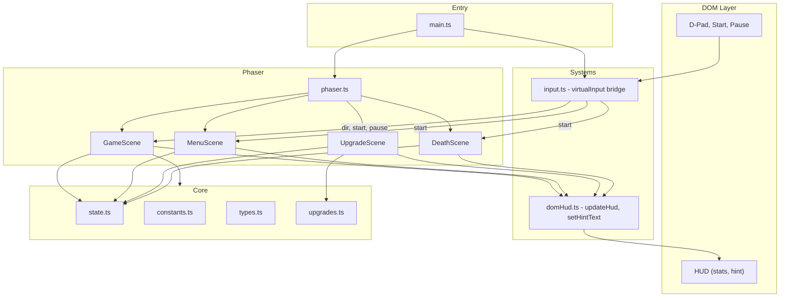
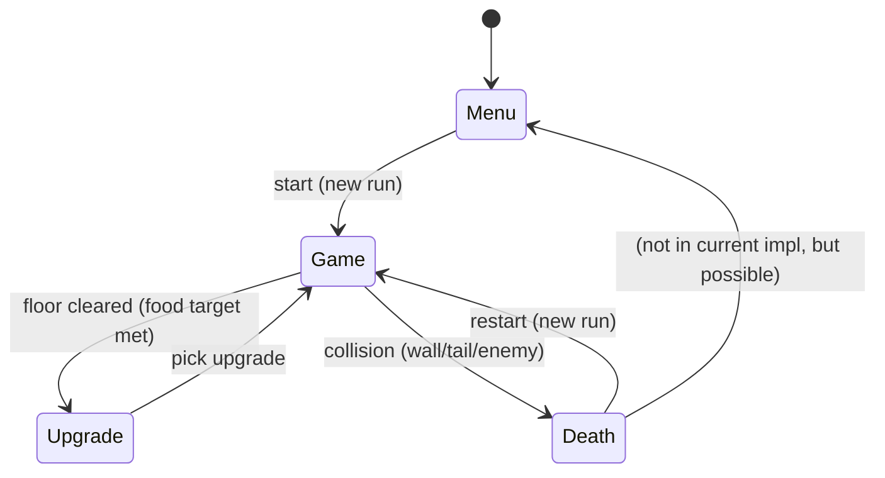

# Design: Document Current Specs

## Context

Znake is a roguelite Snake prototype built with Phaser 3, Vite, and TypeScript. The game has no formal specification; this design documents the as-built architecture so future changes can be spec-driven. The codebase is small and cohesive: four Phaser scenes (Menu, Game, Upgrade, Death), a shared game state, an input bridge via `window.virtualInput`, and a DOM HUD for stats and controls.

## Goals / Non-Goals

**Goals:**

- Capture current game behavior as requirements
- Define capabilities that map to existing modules (core, gameplay, input-hud, scenes)
- Establish a baseline for future spec-driven changes

**Non-Goals:**

- Changing or refactoring the implementation
- Adding new features
- Defining implementation-level details in specs (only observable behavior)

## Architecture

## Scene Flow

## Decisions

| Decision | Rationale |
|----------|------------|
| One spec per logical capability | Aligns specs with modules (game-core, gameplay, input-hud, scenes). Avoids one monolithic spec. |
| Specs describe observable behavior | Requirements use SHALL/MUST for testable outcomes. Implementation details stay in code. |
| `game-core` covers types, constants, state | Shared types and state are the foundation; specs document how they are used, not their structure. |
| `gameplay` covers snake, food, enemies, powerups | Core loop mechanics. Specs focus on rules, scoring, and collision outcomes. |
| `input-hud` covers virtualInput and DOM | Single spec for the bridge: how input reaches scenes and how HUD reflects game state. |
| `scenes` covers scene lifecycle and transitions | Scene flow, data passed between scenes, and when transitions occur. |

## Risks / Trade-offs

| Risk | Mitigation |
|------|------------|
| Specs drift from code | Archive process merges deltas; future changes require spec updates. |
| Over-specification | Focus on observable behavior and scenarios, not internal logic. |
| Missing edge cases | Document main flows first; add scenarios as gaps are discovered. |

## Open Questions

- None. This is a documentation-only change.
