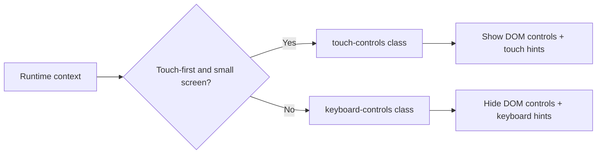

## Context

Znake renders gameplay with Phaser and uses DOM overlays for HUD and touch controls. Before this change, touch controls were always visible, and hint text assumed touch usage. The gameplay loop also had a regression where the snake head rendered but tail drawing was skipped because of early return logic in the render loop.

## Goals / Non-Goals

**Goals:**
- Detect whether the player is in touch-first small-screen mode or keyboard/large-screen mode.
- Show touch controls only when appropriate for mobile/no-keyboard contexts.
- Keep keyboard input active on desktop and present desktop-appropriate hint text.
- Ensure snake growth is deterministic and visible after eating food.
- Ensure snake tail segments are always rendered when present.

**Non-Goals:**
- Rework enemy AI or progression balance.
- Add gamepad support.
- Introduce dynamic runtime remapping of key bindings.

## Decisions

- Add a dedicated control-scheme system (`controlScheme.ts`) that computes mode from media queries:
  - Touch mode: coarse/no-hover pointer and not large screen.
  - Keyboard mode: all other contexts.
- Represent mode in `body` class names (`touch-controls`, `keyboard-controls`) and let CSS control HUD visibility.
- Centralize mode-aware hint strings in `domHud.ts` to avoid scene-level duplication.
- Use explicit `pendingGrowth` increment on food collection and consume it during movement resolution, instead of relying on implicit `ateFood` only.
- Replace render-loop `return` with `continue` for snake-head branch to avoid aborting tail draw.

## Risks / Trade-offs

- [Risk] Convertible devices may switch between touch and keyboard contexts dynamically. -> Mitigation: media query listeners re-apply mode on changes.
- [Risk] Over-aggressive hiding of controls on tablet landscape could reduce accessibility. -> Mitigation: threshold uses both pointer type and screen width, not width alone.
- [Risk] Hint text inconsistency across scenes. -> Mitigation: all scene hints call shared helpers in `domHud.ts`.

## Migration Plan

- No data migration required.
- Deploy as standard frontend release.
- Rollback strategy: revert control-scheme introduction and scene hint helper calls if unexpected device-detection issues appear.

## Open Questions

- Should we add a manual override toggle (force touch controls on desktop/tablet) in settings?
- Should gamepad support map to keyboard mode hints or get a third mode?
