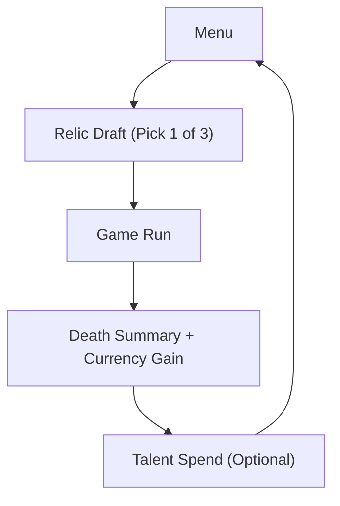

## Context

Current Znake progression is mostly run-local: score, upgrades, and run performance reset with little persistent meaning. The game already has strong moment-to-moment tension, so the next leverage point is a lightweight long-term loop that rewards repeated runs without breaking difficulty.

## Goals / Non-Goals

**Goals:**
- Introduce one persistent economy that is understandable in under 30 seconds.
- Add a run-start relic draft that changes playstyle immediately.
- Add a short, capped talent tree that improves consistency, not auto-win power.
- Preserve existing gameplay pacing and scene transitions.
- Keep implementation MVP-friendly and testable.

**Non-Goals:**
- Full live-ops economy or server-authoritative progression.
- Complex inventory/crafting systems.
- Dozens of relics/talent nodes in first release.

## Decisions

- Use a versioned local profile object (`profileVersion`, `currency`, `unlockedTalents`, `lifetimeStats`).
- Add a pre-run relic draft step between Menu and Game (3 random options, pick 1).
- Apply relic and talent effects through the same run config pipeline already used by upgrades.
- Add deterministic reward formula at run end:
  - currency gain = floor-weighted score component + kills bonus + floor completion bonus
- Start with 3 relics and 6 talent nodes (2 per branch) to keep balancing manageable.

## Risks / Trade-offs

- [Risk] Power creep reduces challenge too quickly. -> Mitigation: cap talent effects and tune costs for slow progression.
- [Risk] Extra pre-run step adds friction. -> Mitigation: one-click draft UI with fast defaults.
- [Risk] Local storage corruption or schema drift. -> Mitigation: versioned profile schema with safe defaults and migration guard.

## Migration Plan

- Introduce profile loader with schema version check.
- If no profile exists, create default profile.
- If legacy profile exists, migrate or reset with non-fatal fallback.
- Ship behind feature flag if needed for staged rollout.

## Open Questions

- Should talent spending happen only in menu, or also immediately after death?
- Should relic draft include reroll in MVP, or add in later iteration?
- What is the exact target session count to first meaningful unlock?
