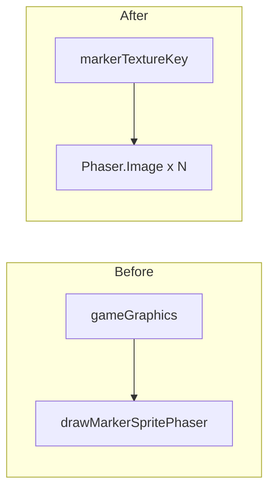

## Context

`registerMarkerHiResTextures` registers `marker_hi_<tone>` canvas textures from `drawMarkerSpriteCanvas` (bitmap → procedural). World entities and the glossary already use this path. The **reference board** grid was a leftover path using `drawMarkerSpritePhaser` only.

## Goals / Non-Goals

**Goals:** Align reference board pixels with **glossary + in-game** markers.

**Non-Goals:** Changing `drawMarkerSpritePhaser` for other hypothetical uses; adding new dev scenarios.

## Decisions

| Decision | Rationale |
|----------|-----------|
| **Pool `Phaser.Image` per reference cell** | Reuses existing texture keys; no extra canvas snapshot per frame. |
| **Depth 8** | Matches other hi-res marker `Image` depth in `GameScene`. |
| **Hide all reference images at start of `drawFrame`** | Same pattern as `markerFood` / portals; avoids stale visibility. |

## Risks / Trade-offs

| Risk | Mitigation |
|------|------------|
| +24 GameObjects in dev scenario only | Acceptable; reference board is rare. |

