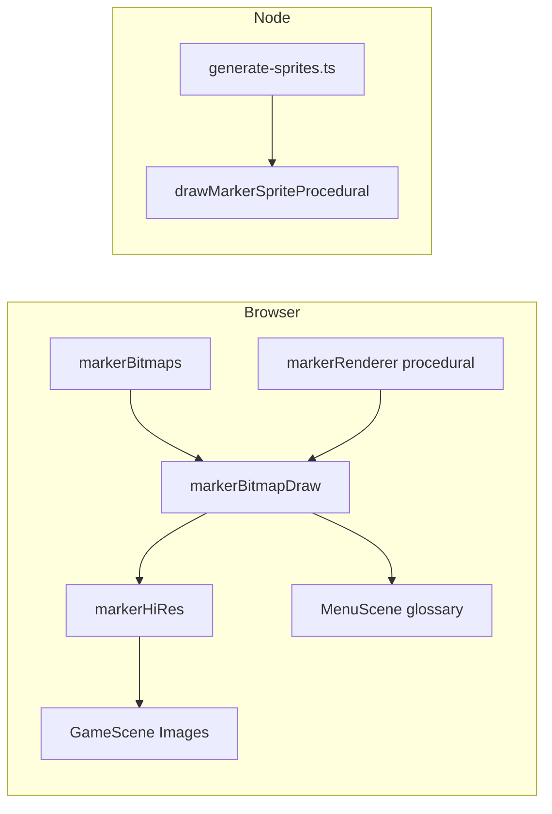
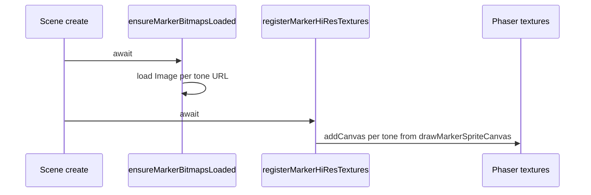

## Context

Markers are keyed by `GlossaryMarkerTone` and must match **export dimensions** from `markerExportSpec` (logical frame × default scale). Procedural art lives in `markerRenderer` / `markerVectorArt`. Vite bundles static assets with hashed URLs in production; Node-based tools must not import `*.png?url` modules.

## Goals / Non-Goals

**Goals:**

- Any tone: optional **bitmap override** from disk with **procedural fallback** if load fails.
- **Single** runtime draw entry (`drawMarkerSpriteCanvas` in `markerBitmapDraw.ts`) for glossary DOM + Phaser canvas textures.
- **generate:sprites** remains runnable in Node and **preserves** existing per-tone PNGs when regenerating the atlas.

**Non-Goals:**

- Phaser `preload()` / `load.spritesheet` for the full atlas (could be a future refactor).
- Using PNG overrides inside `drawMarkerSpritePhaser` (Phaser `Graphics` reference board remains procedural for marker interiors).

## Decisions

### 1. Split procedural vs bitmap wrapper

**Choice:** Export `drawMarkerSpriteProcedural` from `markerRenderer.ts`; export `drawMarkerSpriteCanvas` from `markerBitmapDraw.ts` that prefers `getMarkerBitmap(tone)` then procedural.

**Rationale:** `tools/generate-sprites.ts` imports only procedural code and never pulls Vite-only modules — fixes Node `ERR_UNKNOWN_FILE_EXTENSION` on `.png` imports.

### 2. Discover PNG URLs with `import.meta.glob`

**Choice:** `import.meta.glob('../../../assets/sprites/generated/marker_*.png', { eager: true, query: '?url', import: 'default' })` and map filenames to tones.

**Rationale:** Adding a new `GLOSSARY_MARKER_TONES` entry and a matching PNG file requires no new import lines; Vite includes only matched assets.

### 3. Load all marker images up front

**Choice:** `ensureMarkerBitmapsLoaded()` uses `Promise.all` over every tone URL.

**Rationale:** Simple; total size is small (24 frames × 40×40). Avoids per-frame async in `drawMarkerSpriteCanvas`.

### 4. generate:sprites preserve-if-exists per tone

**Choice:** If `marker_${tone}.png` exists in `OUT_DIR`, `loadImage` and draw; else `drawMarkerSpriteProcedural`.

**Rationale:** Matches artist workflow: replace PNG → stays until deleted. To **refresh from code**, delete that tone’s PNG (or clear generated folder) and re-run.

### 5. Async `create()` + `gameCreateComplete` gate

**Choice:** `await ensureMarkerBitmapsLoaded()` before registering textures; `update()` returns until `gameCreateComplete`.

**Rationale:** Phaser does not await async `create()`; prevents `setVisible` on undefined marker `Image` objects.

## Risks / Trade-offs

| Risk | Mitigation |
|------|------------|
| Stale PNGs after code-only art changes | Document: delete affected `marker_*.png` or run clean generate |
| 24 parallel image requests on slow networks | Acceptable for small assets; could add loader UI later |
| Glob path typo breaks all bitmaps | Fallback to full procedural; validate with `pnpm validate:markers` |

## Migration Plan

No DB or API migration. Developers: pull changes, run `pnpm install`, `pnpm generate:sprites` optional (existing PNGs preserved). Replace any `marker_<tone>.png`, restart dev server / hard refresh.

## Open Questions

- Whether to add `FORCE_PROCEDURAL=1` for generate to ignore on-disk PNGs (convenience flag).

## Architecture

