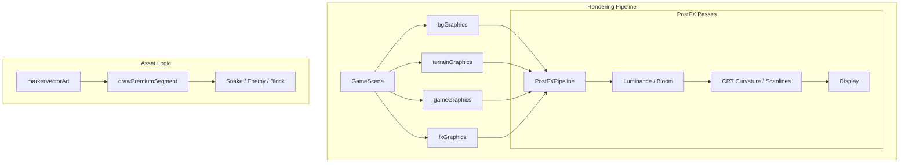

## Context

The game currently uses `Phaser.GameObjects.Graphics` for most entities, drawing flat colored squares. Post-processing is not enabled. All markers have premium procedural art, but the snake/enemies match only in color, not in "premium" look and feel.

## Goals / Non-Goals

**Goals:**
- Implement a **Phaser PostFX Pipeline** for Bloom, Scanlines, and CRT Curvature.
- Refine the snake/enemy drawing logic to follow the "Premium Squared" aesthetic (Circuit-Core).
- Add dynamic parallax grid and nebula background.
- Integrate "High-Resolution" (additive-blended) particles for "Photon Sparks."

**Non-Goals:**
- Porting all entities to real 3D models.
- Overhauling core gameplay or collision logic.

## Decisions

- **Architecture**: Use `Phaser.Renderer.Scenes.PostFXPipeline` for full-screen effects. This keeps scene drawing logic separate from visual "sweetening."
- **Shader Management**: Shaders will be embedded as template literal strings in a new `src/game/render/shaders.ts` module to avoid complex asset loading in the prototype.
- **Visual Logic**: Update `GameScene.ts` and `markerVectorArt.ts` to include a `drawPremiumSegment` utility that handles rounded-rects, internal glows, and rims for all grid-based entities (snake, enemies, hazards).
- **Accessibility**: All shader intensity and particle counts MUST respect `isReducedEffectsEnabled()`.

## Architecture

## Risks / Trade-offs

- **Memory/GPU**: Multi-pass shaders can lag on low-power devices. We'll optimize the Bloom pass by downsampling the luminance texture.
- **Contrast**: Extreme neon glow can wash out the grid intersections, which are critical for movement. We must maintain a baseline grid visibility.
