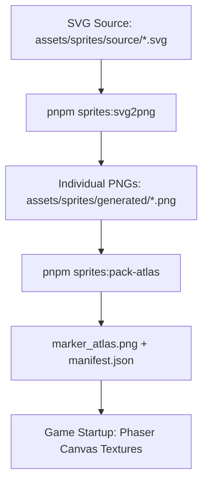

## Context

Current marker assets in `assets/sprites/generated` are primarily produced via a procedural renderer (`markerRenderer.ts`). This makes manual art direction difficult, as artists must modify code rather than vector art files. The current `svg-to-png.ts` script is rudimentary and lacks features for previews or strict alignment checks.

## Goals / Non-Goals

**Goals:**
- Transition to a **Vector-First** asset pipeline.
- Automate the generation of game-ready PNGs and atlas packing.
- Provide a "Dry-Run" mechanism for rapid iteration on new SVGs.
- Enforce the "Premium Squared Neon" style through automated validation where possible.

**Non-Goals:**
- Converting the game to runtime SVG rendering (Phaser performance).
- Building an in-browser SVG editor.
- Replacing the procedural fallback (it remains for any tones missing an authored asset).

## Decisions

### 1. The Asset Pipeline Workflow

**Rationale**: Keeping the pipeline simple and command-line-driven ensures it can be integrated into CI and used by both humans and AI agents.

### 2. SVG Tooling: `@resvg/resvg-js`
We will continue to use `@resvg/resvg-js`.
- **Pros**: Blazing fast (Rust-based), high standard compliance, zero system dependencies (no need for Inkscape/ImageMagick).
- **Rationale**: It fits the strict, high-performance nature of the project.

### 3. "Dry-Run" & Agent Skill
We will create a specialized agent skill at `.agent/skills/asset-dry-run`.
- **How**: The skill will call the `svg-to-png.ts` script with a `--dry-run` flag, outputting to a temporary `/tmp/asset-previews` folder.
- **Feedback**: The agent will then use `view_file` on the resulting PNG to show the user the result before committing to `generated/`.

### 4. Dimensional Standardization
- **Logical Size**: 20x20 units.
- **Render Size**: 40x40 px (2x scale).
- **Padding**: Enforced 2px "safe-zone" in SVG templates.

## Risks / Trade-offs

- **[Risk]** SVGs with complex CSS filters or gradients might look different between browser and `resvg`.
  - **Mitigation**: Encourage "Premium Squared Neon" style (flat shapes, solid fills) which is perfectly rendered by `resvg`.
- **[Trade-off]** Versioning both SVG and PNG.
  - **Mitigation**: SVGs are small. Keeping both in Git ensures the build is reproducible without tool installation for collaborators.
