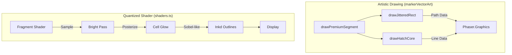

## Context

The current `premium-squared-neon` system uses clean, rounded-rect procedural geometry and a smooth exponential bloom shader. This provides a "perfect" digital look. We will now introduce a "Hand-Drawn / Cell-Shaded" layer to add artistic character and a "sketchy" vibe.

## Goals / Non-Goals

**Goals:**
- Implement **Procedural Jitter** for all segment outlines.
- Implement **Hatch Shading** for segment cores to replace smooth gradients.
- Update the shader pipeline to support **Posterization** (quantized glow) and **Ink-Outline** effects.
- Ensure the "hand-drawn" look is dynamic and responsive to gameplay tension.

**Non-Goals:**
- Using pre-drawn bitmap assets or complex SVG loading.
- Replacing the neon glow entirely (the goal is "Fusion").

## Decisions

- **Jitter Logic**: Instead of calling `g.fillRoundedRect`, we'll implement a `drawJitteredRect` utility that uses multiple line segments per side with a random `±0.4px` offset.
- **Hatching Logic**: A new `drawHatchCore` routine will be added to `markerVectorArt.ts` that draws parallel diagonal lines with variable thickness linked to the game's pulse timer.
- **Shader Posterization**: We'll update `POST_FX_FRAG` to quantize the luminance component of the bloom pass.
- **Shader Inking**: We'll add a simple edge-detection pass to the fragment shader to draw thick, high-contrast outlines (cell-shading style).

## Architecture

## Risks / Trade-offs

- **Performance (CPU)**: Procedural jitter significantly increases the number of draw commands (lines). We must optimize by only "jittering" at a specific interval or with a low segment count.
- **Readability**: Thick ink outlines can make segments look larger or "heavier." We will need to adjust collision visual scales to match.
