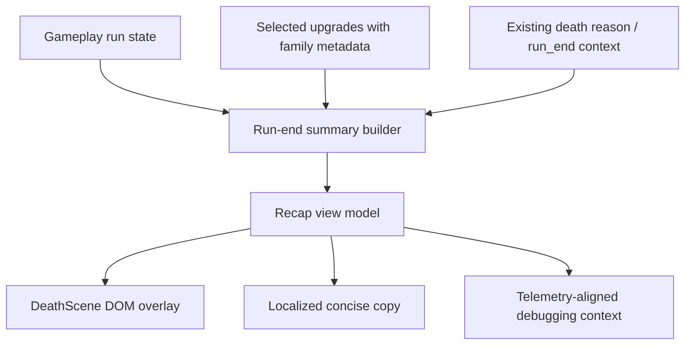

## Context

The current death scene already uses a DOM overlay and localized labels, which gives us a good presentation surface but only a shallow summary. Recent work on upgrade families and run-end telemetry means the project already has the beginnings of two strong recap anchors: a stable death reason and family-aware upgrade metadata. The main design constraint is to turn those ingredients into a concise player-facing story without bloating the overlay, coupling more gameplay logic into `DeathScene`, or inventing separate tracking that will drift from the actual run state.

## Key Points (Codex-style)

### What is changing

- Introduce a recap assembly step for the death summary that converts run-end state into three compact slices: death cause, build-family leaning, and notable choices.
- Update the death overlay contract so recap content is readable in portrait mobile and desktop widths without a full scene redesign.
- Reuse existing selected-upgrade metadata and run-end telemetry/state fields as recap inputs wherever possible.

### Why we are doing it

- Players need immediate feedback on why they lost and what kind of build they created.
- Znake benefits from stronger build identity reinforcement, especially because upgrade families are already intended to shape playstyle.
- A lightweight recap improves fairness/readability while preserving iteration speed and a thin scene orchestration layer.

### Impacted areas

- Run-end summary assembly between gameplay state, upgrade identity metadata, and death overlay rendering.
- Death scene DOM composition, localization strings, and responsive hierarchy.
- Observability contracts for run-end context used by recap and future debugging.

### Risks / unknowns

- The heuristic for “build-family leaning” may need tuning if players mix families evenly.
- Notable-choice selection can become noisy if it treats every pick as equally important.
- Some older run-end code paths may expose death context but not yet package recap-ready text tokens consistently.

## Goals / Non-Goals

**Goals:**
- Keep the death recap concise enough to scan in a few seconds.
- Reuse existing run state, selected-upgrade metadata, and telemetry-aligned fields rather than creating duplicate trackers.
- Preserve the architecture split where gameplay rules stay outside scene presentation code.
- Give players a stronger sense of fairness, readability, and run identity at run end.

**Non-Goals:**
- Reworking run-end rewards or progression payouts.
- Rebuilding the full death-scene layout or adding brand-new overlay interaction patterns.
- Adding analytics-only instrumentation that is not needed by gameplay or recap presentation.
- Rebalancing upgrade families or changing reward-draft behavior.

## Decisions

- Add a recap-view-model assembly step between run-end state and `DeathScene` rendering.
  - This keeps `DeathScene` as an orchestrator that consumes prepared data instead of deciding gameplay meaning on its own.
  - Alternative considered: compute recap strings directly in the scene from raw game state. Rejected because it would further couple presentation to core run data and make tests harder.
- Derive build-family leaning from selected upgrade metadata already introduced by the upgrade-identity capability.
  - A simple ranking by family count, with deterministic tie-breaking and a neutral fallback, keeps the summary understandable without pretending to be a deep stats screen.
  - Alternative considered: introduce a new per-family scoring tracker. Rejected because it duplicates information already implied by reward choices and adds maintenance risk.
- Define “notable run choices” as a short, priority-ordered subset of existing run selections rather than a complete build log.
  - This protects readability on mobile and keeps the recap focused on identity-shaping decisions.
  - Alternative considered: show every earned upgrade. Rejected because the death scene already risks becoming text-heavy, especially on portrait layouts.
- Keep observability aligned to the recap by extending the existing run-end contract rather than adding a separate recap event family.
  - Existing `run_end` and `death_reason` context can carry enough information for debugging and parity checks.
  - Alternative considered: emit dedicated recap analytics events. Rejected because it adds instrumentation cost without clear gameplay value.

## Risks / Trade-offs

- [Risk] Mixed-family runs may produce a weak or misleading family leaning. -> Mitigation: define deterministic tie handling and allow a neutral/dual-lean fallback when no family clearly dominates.
- [Risk] Too many notable choices reduce readability and hide the true death cause. -> Mitigation: cap the recap to a small number of identity-shaping picks and prioritize the death-cause line visually.
- [Risk] Reusing current run state may expose incomplete metadata in some code paths. -> Mitigation: specify graceful fallback copy when family or notable-choice inputs are missing.
- [Risk] Responsive copy changes can regress DOM overlay balance on mobile. -> Mitigation: add explicit responsive spec scenarios for stacking, wrapping, and concise text limits.

## Migration Plan

- No persistence or save migration is required because the recap is derived from run-local state.
- Implement the recap builder alongside existing death-summary state assembly, then switch the overlay to consume the enriched view model.
- If rollout quality is poor, rollback is straightforward: keep the existing death summary and remove the recap builder/extra overlay copy while preserving existing telemetry events.

## Open Questions

- Whether notable run choices should prioritize rarity, family-defining picks, or the most recent impactful decisions.
- Whether a tied family leaning should be shown as a blended identity or simplified to “mixed build” for readability.
- Whether the summary should mention non-upgrade choices such as relics immediately in v1 or stay focused on upgrade-driven identity first.
