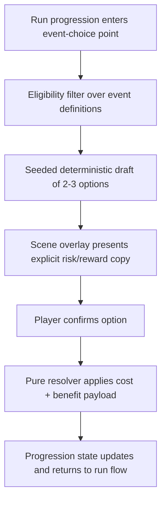

## Context

Znake now has stronger objective and reward foundations, and active run-map work introduces room-type route structure. However, players still need short, legible decisions that add tension and agency between combat outcomes. This change introduces a compact event-choice framework that stays deterministic, data-driven, and fairness-forward while aligning with existing upgrade identity (aggro/control/survival) and avoiding ownership overlap with broader map redesign.

## Key Points (Codex-style)

### What is changing

- Add a deterministic event-choice pipeline: trigger -> draft options -> choose -> resolve -> rejoin progression.
- Introduce first-pass event archetypes (`risky_trade`, `curse_offer`, `safe_vs_dangerous_route`) defined in central data.
- Require player-facing option copy to surface explicit reward and explicit risk before confirmation.
- Keep event resolution in simulation helpers and keep `GameScene` as presentation/orchestration only.

### Why we are doing it

- Give players meaningful route-adjacent decisions beyond combat reward picks.
- Improve run identity expression by coupling event outcomes to existing reward families and tradeoff language.
- Preserve determinism and testability through seeded selection and pure outcome application.

### Impacted areas

- Core progression state and event-choice draft/resolution helpers.
- Balance-config data for event definitions, weights, gating, and fairness thresholds.
- Objective/reward flow integration to prevent pacing conflicts or duplicated choice systems.
- Scene and DOM overlay UI for short, readable event decisions.

### Risks / unknowns

- Risk/reward communication may still be misunderstood if copy is too dense or too abstract.
- Route-affecting events can conflict with run-map cadence if not bounded by clear gating rules.
- Overly conservative fairness filters may reduce decision variety.

## Goals / Non-Goals

**Goals:**

- Define a small, reusable event-choice framework for first-pass risk/reward decisions.
- Keep event drafting and outcomes deterministic and data-driven.
- Keep choices readable, fair, and aligned with existing reward identity.
- Integrate event resolution cleanly into current non-boss progression flow.

**Non-Goals:**

- Building a large narrative event content pool.
- Redesigning full room-map generation or branching architecture.
- Introducing uncontrolled randomness or hidden-outcome effects.

## Decisions

### 1. Add a dedicated `event-choices` capability

Event behavior spans data model, progression, fairness rules, and scene presentation; it should not be buried as incidental text in other capabilities.

Why:
- Keeps event contracts explicit and independently evolvable.
- Prevents reward-loop and scene specs from becoming overloaded with event-specific semantics.

Alternative considered:
- Store all event behavior as a subsection of `objective-reward-loop`. Rejected because event choices are not always reward drafts and can include route-intent consequences.

### 2. Use deterministic seeded drafting with explicit eligibility gates

Draft selection uses run seed + event index + progression context and only considers entries whose gating predicates are true.

Why:
- Preserves replay/debug reproducibility.
- Avoids invalid or unfair options (for example, costs the player cannot pay).

Alternative considered:
- Pure weighted random selection without eligibility checks. Rejected due fairness and determinism requirements.

### 3. Model every option as explicit cost + benefit + metadata

Each option must expose a structured cost and benefit payload plus player-facing risk/reward summary text.

Why:
- Supports clear communication and avoids hidden penalties.
- Enables systemic tuning without scene-local branching logic.

Alternative considered:
- Hand-authored callback logic per event option. Rejected because it couples content authoring to code paths and hurts iteration speed.

### 4. Route-related events can only alter near-term intent hooks, not regenerate maps

`safe_vs_dangerous_route` options can annotate the next room-intent resolution contract (for example safe route favors recovery-oriented outcome hooks; dangerous route favors higher-risk reward intent), but cannot rebuild the graph.

Why:
- Honors existing room-map change ownership and keeps this scope contained.
- Still delivers meaningful route decision flavor in v1.

Alternative considered:
- Full branch graph mutation from event resolution. Rejected as out-of-scope and high integration risk.

### 5. Keep scene role thin: present, confirm, dispatch

`GameScene` shows options, handles confirmation/cancel affordances, and dispatches selected option ID to pure resolution helpers.

Why:
- Maintains architecture boundary between simulation and presentation.
- Keeps event logic testable in isolated modules.

Alternative considered:
- Resolve effects directly in scene handlers. Rejected to avoid coupling and nondeterministic regressions.

## Risks / Trade-offs

- [Punitive-feeling choices] -> Enforce upfront cost visibility and minimum recoverability constraints.
- [Decision fatigue from too many event prompts] -> Add cadence gating and limit event frequency in balance config.
- [Event outcomes overshadow upgrade identity] -> Tag option benefits with identity metadata and cap event power budget relative to upgrade drafts.
- [UI readability on mobile] -> Constrain option count to 2-3 and enforce concise copy lengths.

## Migration Plan

1. Add `event-choices` spec and data contracts for definitions, eligibility, deterministic drafting, and outcome payloads.
2. Add gameplay + objective-reward-loop + scenes deltas to define integration behavior and fairness expectations.
3. Implement pure draft/resolution helpers and progression hooks in apply phase.
4. Integrate event-choice overlay orchestration in scene/UI layer.
5. Validate with `openspec validate znake-event-choices-v1`.

Rollback path:
- Disable event-choice trigger points and revert to existing objective/reward-only progression, leaving added config/data contracts inert.

## Open Questions

- Should v1 allow multiple event-choice points per floor or only one per segment transition window?
- Should curse offers be globally capped per run to prevent stacking frustration?
- Should safe-vs-dangerous route outcomes influence only the immediate next node or a short two-node horizon?
