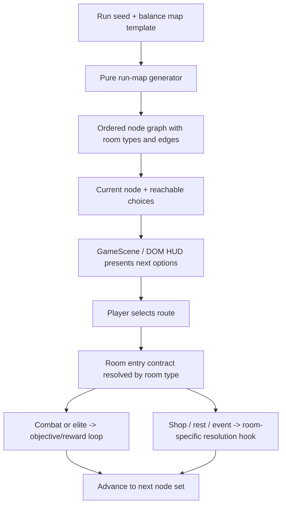

## Context

Znake now has clearer room-level objectives and reward drafting, but the run still feels like a sequence of isolated segments because the player cannot read what path is opening next. Earlier archive work established two useful precedents: dual-portal choices proved that simple route decisions can add strategy, and room-template generation proved floor structure can stay data-driven and deterministic. This change should turn those ideas into a lightweight run-map contract without turning `GameScene` into a progression monolith or implying a full Slay-the-Spire-style metagame screen.

## Key Points (Codex-style)

### What is changing

- Introduce a lightweight run-map state model with explicit room-type nodes and deterministic branch edges.
- Add a narrow preview layer so players can read upcoming room choices from the run HUD/overlay.
- Define how combat, elite, shop, rest, and event nodes resolve against the current objective/reward loop and future room-specific systems.

### Why we are doing it

- Players need readable route-planning information for the run to feel intentional instead of arbitrary.
- Future shop/rest/event content needs a stable room-type contract before bespoke implementations proliferate.
- Keeping map structure in pure, balance-driven data preserves determinism and iteration speed.

### Impacted areas

- Run-progression state, balance-owned map templates, scene orchestration, and HUD overlays.
- Objective/reward integration points for combat and elite nodes.
- Future-facing non-combat room contracts for shop, rest, and event nodes.

### Risks / unknowns

- Previewing too many nodes can overexplain the run and flatten suspense.
- Non-combat node contracts can become vague if we do not define clear entry/exit responsibilities now.
- Reward pacing may drift if elite and non-combat nodes do not rejoin the objective/reward loop cleanly.

## Goals / Non-Goals

**Goals:**

- Define a deterministic run-map model with explicit room types and stable branching.
- Keep room-type authoring data-driven through centralized templates and weights.
- Show just enough upcoming route information for player planning without introducing a full-screen world map.
- Keep combat/elite rooms aligned with the current objective/reward loop.
- Reserve clear contracts for shop/rest/event nodes so follow-up changes can build on them cleanly.

**Non-Goals:**

- No full implementation of all future shop, rest, or event room content.
- No redesign of the biome system or floor-theme pipeline.
- No replacement of the existing objective/reward mechanics.
- No large persistent-progression or run-hub rewrite.

## Decisions

### 1. Add a dedicated `run-map` capability instead of stretching `gameplay` alone

The room graph, node metadata, and route preview rules deserve their own capability because they describe run structure, not only room resolution.

Why:

- The change introduces a new player-facing system with its own data model and progression semantics.
- It keeps `gameplay` focused on what happens inside rooms while `run-map` owns how rooms connect.

Alternative considered:

- Keep everything inside `gameplay` deltas only. Rejected because it would blur room-resolution rules with route-graph structure and make future shop/event work harder to scope.

### 2. Model room types as explicit node contracts, not implicit tags on objectives

Each map node should include a room type plus resolution metadata. `combat` and `elite` route into the current objective/reward loop, while `shop`, `rest`, and `event` expose reserved non-combat entry contracts and rejoin the map afterward.

Why:

- It gives designers a stable vocabulary for route planning and future content.
- It avoids forcing non-combat rooms to masquerade as odd objective variants.

Alternative considered:

- Represent all room types as specialized objective kinds. Rejected because shop/rest/event behavior is structurally different from combat goals and would overcouple unrelated systems.

### 3. Limit route visibility to the next branching horizon

Players should see the immediate reachable choices and their room types, plus enough surrounding context to understand depth progression, but not the entire future path tree.

Why:

- It improves planning readability without removing uncertainty.
- It keeps HUD/overlay scope small and avoids a full map-screen rewrite.

Alternative considered:

- Reveal the full run graph from the start. Rejected for v1 because it adds UI scope and can make the run feel solved too early.

### 4. Keep map generation and selection deterministic through seeded, balance-owned templates

The run map should be generated from centralized templates, room-type weights, and branch rules that consume the run seed in pure helpers.

Why:

- Deterministic routing is a project goal and supports future replay/debug tooling.
- Balance-owned templates let designers tune elite density, rest spacing, and branch cadence without scene-local logic.

Alternative considered:

- Generate node types directly in scene code during transitions. Rejected because it hides progression rules in presentation orchestration and weakens reproducibility.

### 5. Keep `GameScene` as orchestrator for map choice and room entry

`GameScene` should read the active map state, show route options through the existing DOM/HUD stack, accept a route choice, and enter the resolved room. The scene should not own branch generation rules or room-type semantics.

Why:

- Preserves the repo’s target architecture of simulation/core rules separated from presentation.
- Makes future UI changes cheaper because room-graph logic remains outside the scene.

Alternative considered:

- Put run-map generation and branching decisions directly inside `GameScene`. Rejected because that would repeat the coupling pattern the project is actively moving away from.

## Risks / Trade-offs

- [Route previews overexpose the run] -> Keep the preview horizon short and configurable in balance data.
- [Non-combat room contracts feel underspecified] -> Define explicit entry/exit requirements now even if their detailed content lands in follow-up changes.
- [Elite pacing drifts from current reward cadence] -> Treat elite nodes as a typed variation of the existing room objective/reward loop rather than a separate progression system.
- [Scene/HUD implementation grows into a map-screen rewrite] -> Reuse existing overlay and run-HUD patterns, and keep v1 to local branching choices only.

## Migration Plan

1. Add a new `run-map` spec and matching runtime data model for node graph, room types, and preview state.
2. Extend balance config with deterministic map templates, room-type distributions, and preview-horizon tuning.
3. Update gameplay progression wiring so room resolution reads from room type instead of assuming a uniform segment loop.
4. Add scene/HUD orchestration for presenting the current branch choices and entering the selected next node.
5. Validate the change with `openspec validate znake-room-type-run-map-v1`.

Rollback is low-risk because the change can fall back to the current linear or portal-based progression path by removing the map generator and route-preview integration.

## Open Questions

- Whether elite nodes should guarantee stronger reward choice composition in v1 or only imply higher risk within current reward rules.
- Whether shop/rest/event nodes should be allowed to appear before the first elite branch or only after the run establishes baseline combat rhythm.
- Whether route preview should remain always visible in compact HUD form or appear only during room-exit decision windows.
