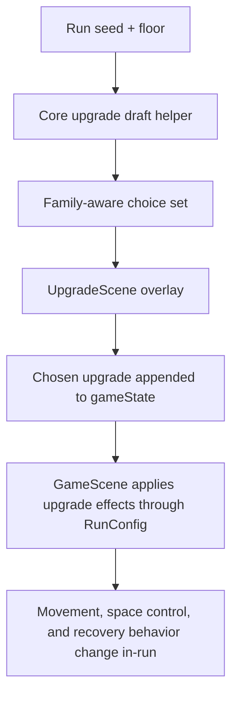

## Context

The current upgrade draft uses a single flat pool of upgrades with minimal metadata: each entry has text, icon, color, and a run-config mutator. That keeps implementation simple, but it also makes reward flow blind to family identity, synergy, or draft clarity. Because run modifiers are already applied through `RunConfig` before gameplay starts, the cleanest path is to keep upgrade effects data-driven in core modules and let scenes consume descriptive metadata.

## Key Points (Codex-style)

### What is changing

- Introduce a formal family taxonomy and richer upgrade definitions.
- Add a draft-selection helper that can present stronger family contrast without hardcoding scene rules.
- Extend run config with a few identity-oriented knobs that change movement and space decisions.

### Why we are doing it

- Give players a recognizable build direction by floor one and two.
- Keep gameplay logic in core modules while making reward UI more expressive.
- Avoid rebuilding the upgrade contract again when more families or reward sources are added later.

### Impacted areas

- Shared upgrade types and balance-owned defaults.
- Upgrade drafting logic and DOM overlay copy.
- GameScene application of run config for pressure, pacing, and recovery effects.

### Risks / unknowns

- New config knobs may overlap with planned combat/readability work if we couple them too tightly.
- Draft rules must stay deterministic per run.
- Stronger early identities can expose balance issues faster than the current flat pool.

## Goals / Non-Goals

**Goals:**
- Keep upgrade data centralized and data-driven.
- Ensure each family changes how the player approaches movement or space.
- Add just enough metadata for reward flow to surface identity cleanly.
- Preserve deterministic drafting within a run seed.

**Non-Goals:**
- Shop or economy redesign.
- Deep rarity, weighting, or unlock systems.
- Rendering-specific upgrade logic.
- Broad combat rebalance outside the defined family pool.

## Decisions

- Add explicit family metadata to upgrade definitions rather than inferring families from ids.
  - This keeps the reward contract stable and readable for UI, telemetry, and future content.
  - Alternative considered: infer families from naming conventions. Rejected because it is fragile and not designer-friendly.
- Introduce a dedicated draft helper in core upgrade logic that returns upgrade choices with simple family-aware rules.
  - The helper can favor diversity in early picks while staying deterministic from the run seed.
  - Alternative considered: keep random sampling in `UpgradeScene`. Rejected because reward policy belongs in core logic, not presentation.
- Expand `RunConfig` with a small set of identity-facing knobs instead of encoding family behavior inside scenes.
  - Examples: food magnet radius, powerup score bonus multiplier, regen timing, shield-on-floor-start behavior, and enemy slow strength.
  - Alternative considered: special-case effects inside `GameScene` for individual upgrades. Rejected because it increases coupling and makes tests/specs harder to reason about.
- Keep tradeoff and synergy notes as descriptive metadata first, with only a few direct mechanical tradeoffs in the initial pool.
  - This makes the first pass legible without needing a full drafting strategy engine.

## Risks / Trade-offs

- [Risk] Too many new run-config flags create accidental complexity. -> Mitigation: add only fields used by the initial family set and keep defaults centralized.
- [Risk] Family-aware drafting can feel repetitive if it over-forces one option per family. -> Mitigation: use simple soft rules that preserve randomness after minimum contrast is satisfied.
- [Risk] Stronger survival tools can flatten tension. -> Mitigation: pair forgiveness tools with lower scoring or speed pressure where appropriate.
- [Risk] Aggro upgrades can become mandatory if their payoff is purely additive. -> Mitigation: tie several aggro picks to tighter routing or reduced safety instead of raw value only.

## Migration Plan

- No persistence migration is required because upgrades remain run-local.
- Existing upgrade scene and death summary continue consuming the same selected-upgrade list shape with added metadata.
- Rollback is straightforward: restore the previous flat pool and remove new run-config fields if balance results are poor.

## Open Questions

- Whether family-aware drafting should guarantee all three families every draft or only bias toward variety.
- Whether future relics/talents should reference the same family tags for cross-system synergy surfacing.
