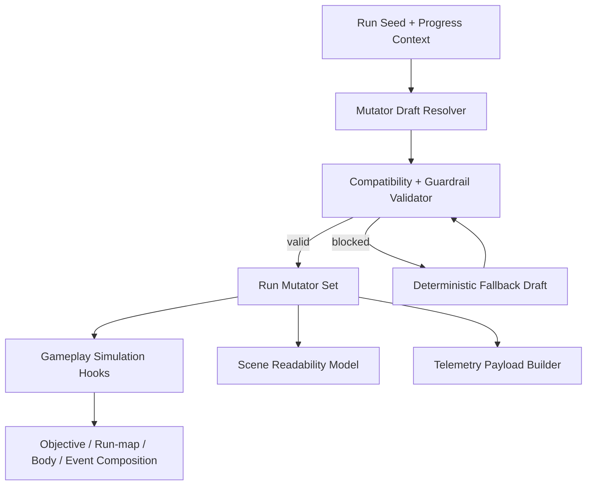
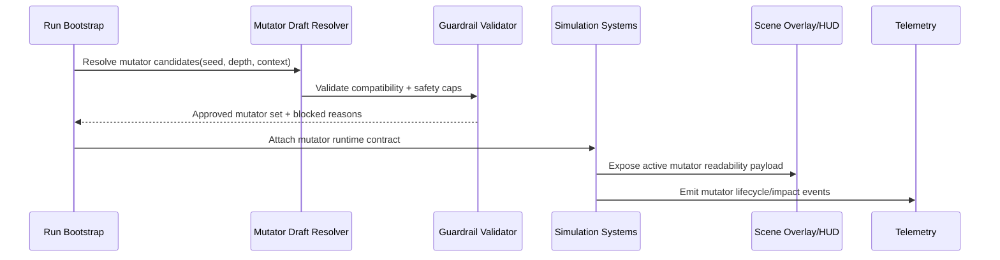

## Context

The current run loop already has clearer objectives, post-objective choices, and room-type routing intent, but long-run replay variety still depends mostly on content growth. This change introduces a deterministic mutator layer that composes with existing systems rather than replacing them.

Mutators must preserve core architectural constraints:
- Simulation owns deterministic rule resolution.
- Presentation only reads mutator state for readability cues.
- Balance config remains the single source of tuning truth.

## Key Points (Codex-style)

- **What is changing**
  - A deterministic mutator pipeline is added at run assembly time, with centralized taxonomy + compatibility metadata and runtime guardrails.
- **Why we are doing it**
  - To improve replayability through systemic variation while keeping runs fair, readable, and debuggable.
- **Impacted areas**
  - Run bootstrap, balance config schema, objective/run-map/body-economy/event hook points, scene mutator surfaces, and observability payloads.
- **Risks / unknowns**
  - Combined mutators may produce hidden difficulty spikes; mitigated via explicit conflict matrices, capped stack pressure, and required readability payloads.

## Goals / Non-Goals

**Goals:**
- Add a first-pass mutator taxonomy with explicit compatibility tags and deterministic activation rules.
- Keep mutator content centralized in balance configuration.
- Define safe composition contracts across objective/reward loop, run-map, body-economy, and event choices.
- Require readability and anti-frustration protections by contract.
- Emit stable telemetry for mutator selection and outcomes.

**Non-Goals:**
- Full meta-progression redesign.
- Permanent stat inflation systems.
- Content-heavy biome expansion.

## Decisions

### 1) Deterministic mutator draft and activation
Mutators are drafted from seeded pools during run assembly and bound to the run context before first gameplay tick.

Why:
- Guarantees reproducibility for debugging, balancing, and fairness validation.
- Avoids scene-local randomness drift.

Alternatives considered:
- Real-time random mutator rolls during rooms: rejected due to poor replay determinism and hard-to-debug spikes.
- Manual-only mutator selection: rejected for v1 to keep onboarding simple.

### 2) Balance-config as single source of mutator truth
All mutator definitions (effects, tags, weights, blacklist rules, anti-frustration caps) are authored in centralized config.

Why:
- Keeps tuning iteration fast and avoids hardcoded constants spread across systems.
- Aligns with current data-driven architecture goals.

Alternatives considered:
- Separate mutator JSON files per feature: rejected for v1 due to schema drift risk.
- Inline constants in gameplay modules: rejected due to coupling and regression risk.

### 3) Composition by contract, not ad hoc checks
Each mutator declares effect domains and compatibility constraints, and composition resolves through deterministic validators.

Why:
- Prevents hidden interactions with objectives, run-map intent, body economy, and event choices.
- Keeps GameScene orchestration thin while simulation validates outcomes.

Alternatives considered:
- One-off guard checks per subsystem: rejected as brittle and hard to audit.

### 4) Readability-first UX contract
Mutators must expose concise player-facing labels, risk/reward summaries, and active-state surfacing in run HUD/overlay.

Why:
- Players need fast comprehension for fairness and decision quality.
- Supports game-feel goals: clarity, feedback, and perceived fairness.

Alternatives considered:
- Hidden mutators for surprise factor: rejected for v1 due to frustration risk.

### 5) Anti-frustration guardrail layer
A mandatory guardrail pass enforces max simultaneous pressure, blocked combinations, early-run safety windows, and recoverability floors.

Why:
- Protects fairness and prevents non-recoverable run states.
- Preserves body-economy and objective solvability.

Alternatives considered:
- Purely manual balancing review: rejected because it does not scale with combinations.

### 6) Observability as rollout safety net
Mutator lifecycle events (`drafted`, `activated`, `blocked`, `resolved_impact`) are required with run context.

Why:
- Enables evidence-based balancing and regression detection.

Alternatives considered:
- No new telemetry until v2: rejected; would hide risk during initial rollout.

## Architecture Overview

## Data Flow

## Risks / Trade-offs

- [Risk] Excessive difficulty spikes from stacked pressure mutators -> Mitigation: enforce pressure budget ceiling + blocked pair matrix.
- [Risk] Objective or event outcomes become non-recoverable -> Mitigation: recoverability validator with deterministic fallback and explicit rejection reasons.
- [Risk] UI overload from too many active effects -> Mitigation: cap simultaneously displayed mutators and require concise copy constraints.
- [Risk] Tuning churn due to many parameters -> Mitigation: central schema defaults and telemetry-backed iteration.

## Migration Plan

1. Add balance schema fields for mutator taxonomy, compatibility, activation weights, and guardrails.
2. Introduce deterministic draft/validation pipeline at run bootstrap.
3. Wire simulation composition hooks for objective/run-map/body-economy/event-resolution contexts.
4. Add scene-readable mutator preview + active status model.
5. Add telemetry events and payload fields for mutator lifecycle and outcomes.
6. Run seed-based verification scenarios to confirm reproducibility and fairness constraints.

Rollback strategy:
- Disable mutator activation by config flag while retaining schema scaffolding.
- Preserve telemetry fields as optional payloads for backward compatibility.

## Open Questions

- Should v1 expose player opt-in difficulty bands for mutators, or remain fully automatic?
- Should mutator unlock gating be account-wide by profile milestones or mode-specific only?
- How many simultaneous mutators keep readability high on portrait mobile without reducing strategic depth?
