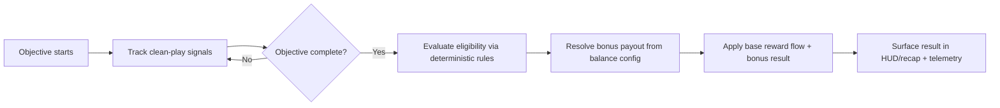

## Context

Znake already has deterministic room objectives, post-objective reward flow, centralized balance tables, and run-end recap surfaces. The missing piece is mastery-specific feedback: a player can execute a clean objective clear but currently receives the same progression outcome as a messy clear.

This change must stay low-cost and preserve fairness. The intended architecture keeps clean-play evaluation in deterministic simulation/runtime state, keeps payout values in centralized balance config, and keeps scene/UI work as orchestration only.

## Key Points (Codex-style)

### What is changing

- Objective completion now evaluates first-pass clean-play conditions (starting with no-hit clears).
- Eligible clears grant deterministic bonus payouts configured in centralized balance tables.
- Clean-play outcome and bonus payout are exposed in objective/reward flow and run-end recap/telemetry.

### Why we are doing it

- To make mastery visible and rewarding without introducing economy complexity.
- To improve player clarity around performance quality and progression outcomes.

### Impacted areas

- Objective runtime state and completion evaluation.
- Reward payout resolution and balance config.
- Scene recap presentation and telemetry payload composition.

### Risks / unknowns

- Bonus payouts can become dominant if values are overtuned.
- Edge conditions (grace windows, shield/body-loss attribution) may create perceived inconsistency if no-hit semantics are unclear.

## Goals / Non-Goals

**Goals:**

- Define deterministic clean-play conditions and first-pass payout rules.
- Keep clean-play rules and values fully centralized in balance config.
- Integrate clean-play outcome into existing objective/reward and run-end recap surfaces.
- Add guardrails that prevent dominant farming loops from clean-play payouts.

**Non-Goals:**

- Redesigning full economy progression.
- Introducing ranked/leaderboard systems.
- Reworking broad progression architecture outside objective-reward flow.

## Decisions

### 1. Evaluate clean-play at objective-window scope using deterministic counters

Clean-play is computed over the active objective window (objective start -> objective complete/fail) from deterministic runtime signals (for v1: whether the player took any qualifying hits in the window).

Why:
- Keeps semantics precise and testable.
- Avoids scene-local heuristics.

Alternative considered:
- Evaluating only at run-end. Rejected because it weakens per-objective mastery feedback and delays reinforcement.

### 2. Keep bonus payouts additive-but-bounded and config-driven

Payout shape, amount, and per-objective cap are declared in balance config. Runtime resolves bonus payout only through these tables, with no scene-local constants.

Why:
- Enables safe tuning without code churn.
- Supports anti-farming constraints in one place.

Alternative considered:
- Hardcoded flat bonus in reward overlay. Rejected because it spreads economy logic into presentation and reduces balancing speed.

### 3. Preserve base reward flow and layer clean-play as supplemental result

Base objective reward draft remains unchanged as the primary progression gate. Clean-play payout is resolved as a deterministic supplemental bonus in the same completion transaction.

Why:
- Minimizes behavioral risk and implementation footprint.
- Avoids destabilizing existing reward identity/tradeoff flow.

Alternative considered:
- Replacing normal reward draft with clean-play-specific draft. Rejected for v1 due higher UX and balance risk.

### 4. Anti-farming guardrails are explicit in rule contract

Clean-play evaluation includes guardrails: objective must be validly completed, bonus can trigger at most once per objective window, and payout must respect configured caps/multipliers by objective kind.

Why:
- Prevents obvious exploit loops while staying deterministic.
- Maintains fairness across objective types.

Alternative considered:
- Post-hoc analytics-only exploit handling. Rejected because prevention should be in rule contract, not only monitoring.

### 5. Scene responsibility remains orchestration-only

`GameScene` and run-end recap scenes display clean-play outcomes from shared resolved state; they do not compute eligibility or payout magnitude.

Why:
- Maintains simulation/presentation separation.
- Prevents divergence between gameplay logic and UI copy.

Alternative considered:
- Letting recap compute inferred clean-play from event history. Rejected because this risks mismatch with actual reward resolution.

## Risks / Trade-offs

- [No-hit semantics feel unfair when temporary protection is active] -> Define qualifying-hit attribution explicitly in gameplay spec and verify with deterministic tests.
- [Payout values encourage repetitive low-risk farming] -> Add per-objective cap and objective-kind tuning knobs; monitor via telemetry.
- [UI clutter from extra mastery messaging] -> Reuse concise existing reward/recap surfaces with short labels and bounded copy length.
- [Cross-module drift between reward resolution and recap output] -> Use one resolved clean-play outcome payload shared by reward flow, recap, and telemetry.

## Migration Plan

1. Add spec deltas for objective-reward loop, balance config, gameplay, observability, and scenes.
2. Add clean-play rule/payout config tables and types.
3. Wire deterministic clean-play tracking and objective completion payout resolution.
4. Feed resolved clean-play summary into reward and run-end recap presentation.
5. Emit telemetry for eligibility/result/payout and validate with deterministic scenarios.

Rollback plan:
- Disable clean-play payout via config flag/zeroed values and ignore clean-play UI labels, preserving baseline objective-reward behavior.

## Open Questions

- For v1 no-hit semantics, should shield-only damage invalidate clean-play or only health/body-loss damage?
- Should payout be one currency lane only (score) or allow objective-kind-specific payout channels in first pass?
- Should recap show aggregate clean clears count only, or also per-objective-kind breakdown in a follow-up?
