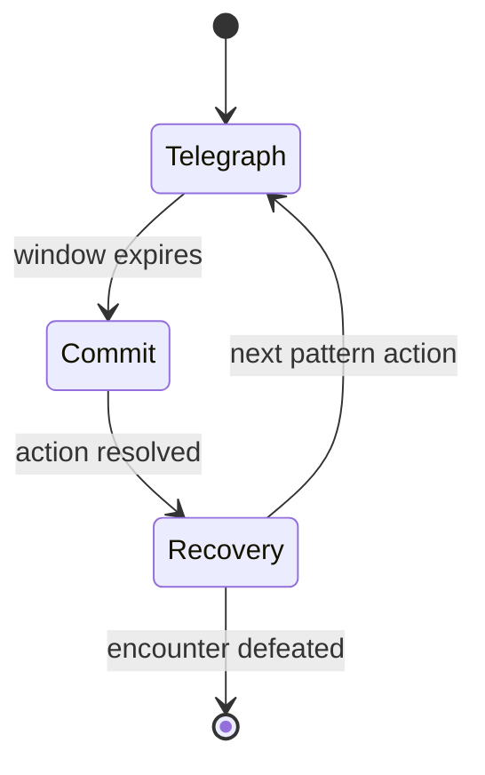

## Context

Current base specs define combat readability, role fairness, and boss-floor scaffolding, but they do not yet define a dedicated elite/miniboss capability contract that ties encounter pattern identity, fairness windows, progression cadence, and telemetry together. This change adds first-pass contracts that keep simulation deterministic, keep scene code presentation-focused, and preserve data-driven tuning in centralized balance config.

## Key Points (Codex-style)

- **What is changing**
  - We introduce deterministic elite/miniboss pattern-kit contracts plus fairness, progression, and telemetry integration rules across existing capabilities.
- **Why we are doing it**
  - We need memorable high-tension encounters that stay readable and fair, so player outcomes feel attributable to decisions rather than hidden spikes.
- **Impacted areas**
  - Gameplay simulation state machines, balance tuning tables, GameScene readability surfaces, and observability reason-code pipelines.
- **Risks / unknowns**
  - If reaction windows are too generous, encounters lose intensity; if too tight, cheap hits return. Cadence tuning must balance drama with fatigue.

## Goals / Non-Goals

**Goals:**
- Define a first-pass elite/miniboss pattern-kit model with explicit readable phases (telegraph, commit, recovery).
- Define fairness constraints for reaction windows, spawn safety, and anti-cheap-hit sequencing.
- Define deterministic progression integration for encounter cadence and objective/reward gating.
- Define telemetry contract coverage for readability outcomes and failure attribution.

**Non-Goals:**
- Full boss architecture rewrite.
- New biome system.
- Global visual redesign beyond readability-essential cues.

## Decisions

### 1) Pattern kits are phase-based and simulation-owned
- Decision: Elite/miniboss actions are modeled as deterministic phase sequences with state labels (`telegraph`, `commit`, `recovery`) exposed to presentation.
- Rationale: Keeps logic testable and deterministic while giving scene/UI enough information for readable warnings.
- Alternative considered: Scene-local timeline scripting per elite. Rejected because it couples gameplay behavior with rendering and weakens determinism.

### 2) Fairness is enforced via explicit anti-cheap-hit constraints
- Decision: Add minimum reaction windows plus anti-overlap constraints that block unavoidable chained hits when valid alternatives exist.
- Rationale: Preserves challenge while protecting player agency and reducing frustration spikes.
- Alternative considered: Only tune damage numbers. Rejected because cheap-hit perception is usually timing/space readability, not raw damage.

### 3) Encounter cadence and gating stay data-driven
- Decision: Encounter frequency, objective coupling, and reward gate behavior are configured centrally in balance tables and consumed by deterministic progression logic.
- Rationale: Allows fast iteration and avoids brittle scene-local constants.
- Alternative considered: Hardcoded per-room cadence in `GameScene`. Rejected due to coupling and higher regression risk.

### 4) Telemetry focuses on readability and attributable failure
- Decision: Emit stable events and reason codes for telegraph visibility, counterplay-window usage, and elite/miniboss failure causes.
- Rationale: Balancing memorable difficulty requires evidence on whether players lose to pressure choices vs unreadable patterns.
- Alternative considered: Aggregate only run-end deaths. Rejected because it loses encounter-level diagnosis.

## Risks / Trade-offs

- [Risk] Encounter templates become too uniform. → Mitigation: Keep kit identity through configurable pattern sequencing and role composition weights.
- [Risk] Extra fairness checks reduce perceived threat. → Mitigation: Enforce minimum windows, not generous invulnerability; preserve commit danger.
- [Risk] Telemetry volume grows quickly. → Mitigation: Use bounded payload fields and stable reason-code enums rather than verbose event spam.

## Migration Plan

1. Add spec-level contracts first (this change) to align implementation and telemetry schema.
2. Implement deterministic pattern-state and fairness-window hooks behind current progression flow.
3. Wire scene readability cues to state exposure without moving gameplay ownership to scene code.
4. Add telemetry events/reason codes and validate payload stability with existing analytics consumers.

Rollback strategy:
- Guard elite/miniboss-specific runtime behavior behind configuration defaults so fallback to existing elite flow remains available.
- Keep pre-existing fairness/readability contracts intact if miniboss counters are disabled.

## Open Questions

- Should first-pass miniboss reward gating always force a reward draft, or only when the encounter is objective-marked (`defeat_elite`/`boss`)?
- Should reaction windows scale by run depth linearly or by bracketed tiers?
- Which minimal failure-reason taxonomy is most actionable for first dashboards (`late_react`, `trapped_path`, `telegraph_missed`, `stacked_pressure`)?

