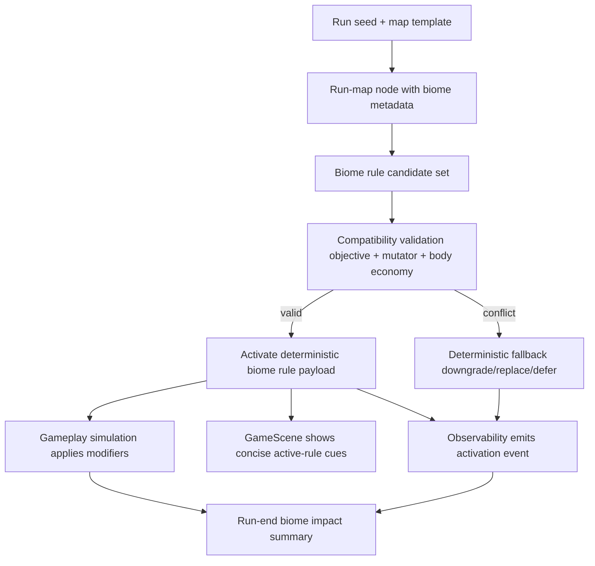

## Context

Current specs cover room objectives, run-map routing, mutator guardrails, and fairness windows, but they do not yet define a generalized biome gameplay-rule layer that changes player decision-making beyond visuals. This change introduces a deterministic biome-rule contract that preserves simulation purity, keeps scene ownership focused on readability, and keeps tuning in centralized balance configuration.

## Key Points (Codex-style)

- **What is changing**
  - We add a deterministic multi-biome rules architecture with taxonomy, activation flow, first-pass gameplay modifiers, compatibility guardrails, and observability/readability contracts.
- **Why we are doing it**
  - We want biomes to meaningfully change movement, routing, and survival pressure so run segments feel strategically distinct and teachable.
- **Impacted areas**
  - Run-map biome metadata, gameplay rule activation/resolution, balance-config policy tables, GameScene HUD overlays, and telemetry payloads.
- **Risks / unknowns**
  - Poorly tuned combinations can collapse fairness or readability. We need bounded first-pass modifier sets and deterministic fallback behavior when constraints conflict.

## Goals / Non-Goals

**Goals:**
- Define a biome-rule taxonomy that classifies first-pass gameplay effects by decision impact (movement, routing, survival-pressure rhythm).
- Define deterministic biome activation based on seed-stable run-map and segment context.
- Define first-pass biome modifiers that force meaningful tactical adaptation while preserving fairness.
- Define compatibility guardrails with objectives, mutators, and body economy systems.
- Define readability and telemetry contracts so active biome rules are understandable and measurable.

**Non-Goals:**
- Art-only biome differentiation.
- Shipping a large multi-biome content pack in one iteration.
- Refactoring unrelated meta progression or upgrade family systems.

## Decisions

### 1) Biome rules use a typed taxonomy with bounded first-pass domains
- Decision: Biome rules are declared through centralized taxonomy entries with stable identifiers and tagged effect domains (`routing_pressure`, `movement_constraint`, `survival_rhythm`).
- Rationale: Typed domains make compatibility checks deterministic and allow quick balancing iteration without scene-level conditionals.
- Alternative considered: Free-form per-biome scripted effects. Rejected because it weakens comparability, makes guardrails brittle, and increases regression risk.

### 2) Activation is deterministic and progression-owned
- Decision: Active biome rule set resolves at deterministic progression boundaries (room/segment entry) from run seed + run-map biome metadata + current global modifiers.
- Rationale: This keeps rules reproducible for the same seed and avoids frame-level nondeterministic drift.
- Alternative considered: Time-based or random in-room biome rule swaps. Rejected because it harms fairness attribution and testability.

### 3) First-pass modifiers emphasize route planning and pressure rhythm
- Decision: First-pass biome modifiers must alter at least one of these decision vectors: safe-lane planning, risk/reward path choice timing, or recovery window pressure cadence.
- Rationale: This enforces game-design value (biomes affect playstyle) rather than cosmetic-only variance.
- Alternative considered: Flat stat multipliers only. Rejected because they create opaque difficulty shifts and lower tactical readability.

### 4) Guardrails are centralized and multi-system aware
- Decision: Compatibility is validated through centralized matrices and pressure budgets that account for objective kind, active mutators, and current body-economy state.
- Rationale: Shared guardrails reduce cross-system conflicts and prevent low-agency combinations.
- Alternative considered: Independent per-system checks. Rejected because distributed checks create hidden conflicts and inconsistent fallback behavior.

### 5) Scene/UI surfaces are descriptive, not authoritative
- Decision: `GameScene` renders concise active biome-rule cues and transition callouts from simulation-owned payloads; it does not resolve rule logic.
- Rationale: Maintains architecture boundaries and keeps gameplay rules testable outside Phaser presentation.
- Alternative considered: Scene computes display + behavior transforms. Rejected due to logic/render coupling and maintainability risk.

### 6) Telemetry tracks activation, guardrails, and impact summaries
- Decision: Emit stable events for biome activation lifecycle and guardrail interventions, plus bounded run-end biome impact summaries.
- Rationale: Enables balancing decisions based on attributable pressure/fairness outcomes rather than anecdotal feedback.
- Alternative considered: Run-end-only aggregate logging. Rejected because it obscures which biome rules produced pressure spikes.

## Risks / Trade-offs

- [Risk] Rule combinations can unintentionally create no-win pathing in high-pressure segments. → Mitigation: Enforce deterministic pressure-budget guardrails with fallback downgrade/replace behavior.
- [Risk] Too many concurrent cues can reduce HUD readability. → Mitigation: Limit simultaneous active-rule cue count and prioritize highest-impact descriptors.
- [Risk] Strict guardrails may flatten biome identity. → Mitigation: Keep guardrail ceilings narrow but allow per-biome pattern signatures through tuned domain weights.
- [Risk] Telemetry payload creep may increase analytics maintenance cost. → Mitigation: Use bounded enums/IDs and stable payload schemas with concise summary fields.

## Migration Plan

1. Add OpenSpec contracts for gameplay, run-map, balance-config, scenes, and observability (this change).
2. Introduce centralized biome taxonomy and compatibility tables in balance config modules.
3. Wire deterministic biome metadata resolution into run-map node/segment context.
4. Integrate activation and guardrail validation into progression-owned gameplay hooks.
5. Expose active-rule presentation payloads to GameScene HUD/overlays.
6. Emit lifecycle and guardrail telemetry, then validate payload stability against existing analytics pipelines.

Rollback strategy:
- Keep biome gameplay-rule activation behind centralized policy toggles; fallback to existing baseline behavior when biome gameplay modifiers are disabled.
- Preserve existing objective/mutator/body-economy behavior when compatibility validation rejects biome modifiers.

## Open Questions

- Should first-pass allow one or two simultaneous biome-rule modifiers per segment by default?
- Which guardrail intervention should be preferred on conflict: downgrade intensity, replace rule, or defer activation to next segment?
- What minimal player-facing label set best communicates tactical impact without UI clutter?

