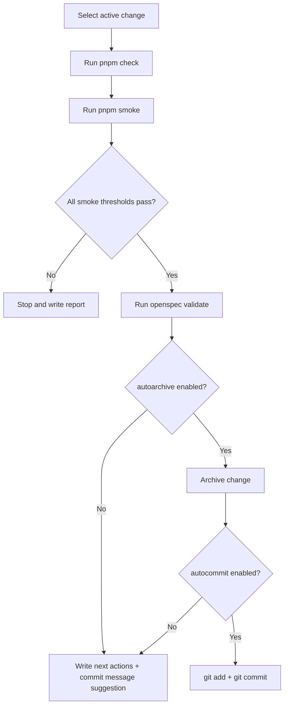

## Context

Znake already has strong deterministic simulation modules and OpenSpec workflows, but the execution loop is still heavily manual: syncing `NEXT_STEPS.md`, crafting prompts, sequencing apply work, running checks, and deciding when to archive/commit. This creates cognitive load and uneven process quality.

The proposed MVP introduces a tooling-first autonomous loop that preserves existing architecture boundaries: gameplay simulation and rendering remain unchanged, while automation lives in `tools/` and OpenSpec artifacts. The loop prioritizes deterministic checks and low AI token usage by template-driven decisions.

## Key Points (Codex-style)

- **What is changing**
  - Add an autoloop orchestrator and headless smoke playtest harness, wired as mandatory gates before verify/archive.
- **Why we are doing it**
  - To move from manual coordination to repeatable automation while maintaining gameplay fairness and deterministic quality checks.
- **Impacted areas**
  - Tooling CLI scripts, package script entrypoints, OpenSpec workflow surface, and smoke metrics storage.
- **Risks / unknowns**
  - Heuristic bot quality and threshold calibration may need iteration; full Phaser runtime parity is out of MVP scope.

## Goals / Non-Goals

**Goals:**
- Provide one-command orchestration for `check -> smoke -> verify readiness -> archive readiness -> commit message prep`.
- Add deterministic automated playtest smoke with stable seeds and measurable heuristics.
- Add resumable state output for interruptions/retries.
- Minimize AI usage through template output and only-on-demand prompt generation.

**Non-Goals:**
- Full autonomous AI code implementation engine inside the repo.
- Full scene-level headless Phaser runtime simulation.
- Replacing OpenSpec lifecycle semantics.

## Decisions

### Decision: Build smoke tests on pure simulation primitives

- Smoke runner will use pure simulation modules (layout generation, occupancy/spawn constraints, deterministic RNG) and a simple heuristic bot.
- Rationale: fast, deterministic, CI-friendly, and avoids render/runtime coupling.
- Alternative considered: run Phaser `GameScene` headless. Rejected for MVP complexity and fragility.

### Decision: Gate order is strict and enforced by orchestrator

- The loop enforces `pnpm check` first, `pnpm smoke` second, then OpenSpec validation/verify-readiness.
- Rationale: fast fail on static quality and gameplay behavior before expensive workflow actions.
- Alternative considered: smoke before check. Rejected because lint/type issues should fail earliest.

### Decision: Low-IA mode emits deterministic prompt artifacts

- Orchestrator stores prompt/context outputs in `.autoloop/` so human+agent runs can reuse text instead of regenerating every loop.
- Rationale: reduces repeated token usage and makes loops resumable.
- Alternative considered: conversational prompt generation every cycle. Rejected for cost and inconsistency.

### Decision: Archive and commit remain explicit flags

- MVP supports `--autoarchive` and `--autocommit`, but defaults to safe non-destructive behavior.
- Rationale: reduces accidental irreversible actions while still enabling full automation when desired.

## Risks / Trade-offs

- [Smoke simulation does not reflect every in-scene interaction] -> Mitigation: treat as smoke gate, not full acceptance; keep deterministic unit/integration tests in place.
- [Thresholds too strict/loose can block or hide regressions] -> Mitigation: persist baseline metrics and tune with controlled config.
- [Autoarchive/autocommit misuse] -> Mitigation: disabled by default, explicit flags required, and clear terminal summary before action.

## Migration Plan

1. Add OpenSpec deltas for tooling and autonomous-dev-loop capability.
2. Implement smoke playtest runner with deterministic seeds and metrics output.
3. Implement loop orchestrator with resumable `.autoloop/state.json` and report artifacts.
4. Add package scripts and docs comments for usage.
5. Run `pnpm check` and `pnpm build` to validate integration.

Rollback strategy:
- Remove new scripts from `package.json` and keep files dormant if workflow causes friction.
- Keep smoke runner as optional command even if orchestration script is temporarily disabled.

## Open Questions

- Should next-step item selection parse only `NEXT_STEPS.md` or also live OpenSpec status by default in MVP mode?
- What default smoke thresholds are strict enough to catch regressions without noisy false fails?
