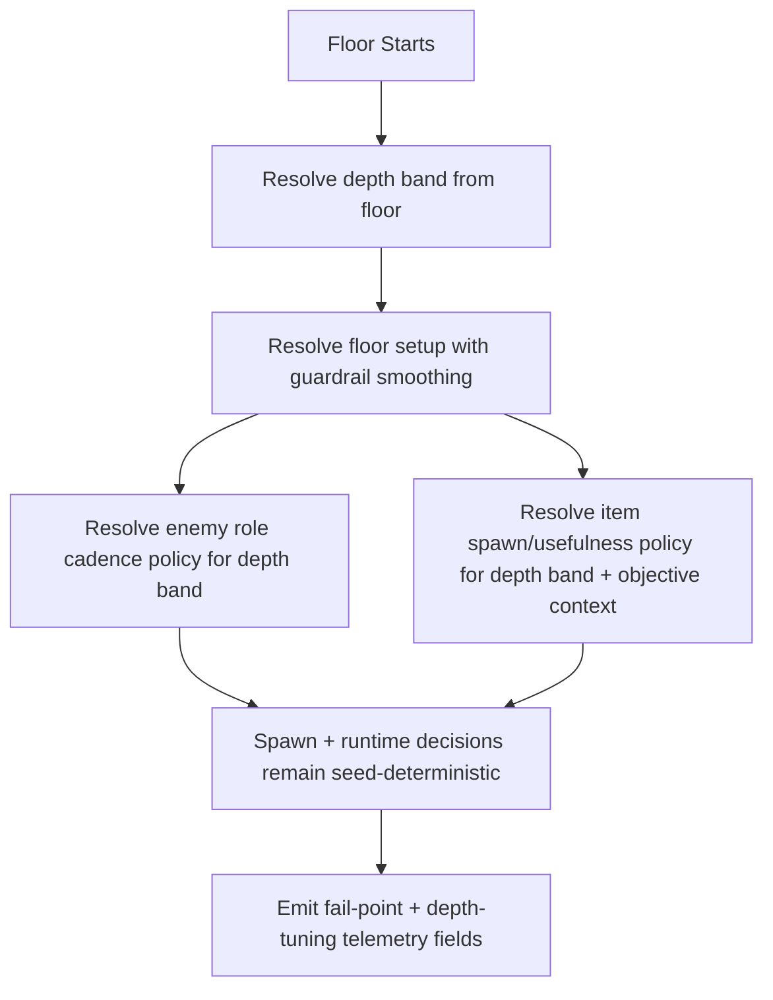

## Context

Current floor scaling relies on linear floor increments plus isolated cadence tables. This makes tuning workable for short sessions, but it is harder to preserve fairness and variety across longer 10-15 floor runs where pressure and relief must be coordinated. Enemy role pacing, elite/special cadence, and item utility are presently tuneable, yet not anchored to one explicit depth-balance contract with observability outcomes.

This change introduces a bounded depth-balance layer that remains deterministic and config-driven. The design keeps simulation rules in balance/config modules and helper functions, while `GameScene` continues orchestrating only resolved values and side effects.

## Key Points (Codex-style)

- **What is changing**
  - Add deterministic depth bands (early/mid/late) for floors 1-15 and bind enemy cadence, item usefulness, and fairness guardrails to those bands.
- **Why we are doing it**
  - To improve long-run clarity and fairness by reducing abrupt spikes and preserving meaningful pressure variety.
- **Impacted areas**
  - `core/balance` contracts, content selection helpers, enemy spawn role cadence policy, run-depth metadata usage, and telemetry emission fields.
- **Risks / unknowns**
  - If relief tuning is too generous, pressure identity drops; if too strict, spike-death rates stay high. Telemetry read quality depends on stable reason taxonomy usage.

## Goals / Non-Goals

**Goals:**
- Define depth bands covering a bounded 10-15 floor run window with explicit pressure progression intent.
- Keep enemy composition varied by depth without losing role readability/counterplay expectations.
- Keep item spawn/effect usefulness meaningful by depth and run context (objective/room pressure state).
- Add deterministic level-band guardrails that dampen pressure spikes and detect flat pacing segments.
- Emit telemetry fields needed to analyze per-level fail points and depth-tuning outcomes.

**Non-Goals:**
- Full biome progression rewrite.
- Large enemy roster expansion.
- Nondeterministic live adaptive difficulty logic.

## Decisions

### Decision: Add a central depth-band contract in balance config

- We will add a single `depthBalance` table in `BALANCE` with floor bands and bounded knobs for pressure progression and guardrail thresholds.
- Rationale: keeps tuning data-driven and avoids scene-local conditional logic drift.
- Alternative considered: spread knobs across existing `floor`, `enemyRoles`, and `item` tables only. Rejected because it obscures tuning intent and increases mismatch risk.

### Decision: Resolve depth-aware enemy/item selections through helper functions

- We will extend content/balance helpers to consume current floor and context and return deterministic tuning selections.
- Rationale: preserves `GameScene` thin orchestration and keeps deterministic policy centralized.
- Alternative considered: compute depth logic inline in scene spawn paths. Rejected due to coupling and harder regression testing.

### Decision: Add bounded guardrail smoothing on floor setup

- We will enforce configured min/max deltas for key per-floor pressure metrics (enemy count/interval/item relief), with deterministic fallback if strict target cannot be met.
- Rationale: directly addresses spike-death and flat-segment risk while preserving level identity.
- Alternative considered: manual one-off floor values for every floor. Rejected for maintainability and slower iteration speed.

### Decision: Emit depth-tuning observability as additive event fields

- We will augment existing telemetry with floor/depth-band fail-point and tuning-context fields instead of creating an independent analytics pipeline.
- Rationale: minimal implementation overhead and immediate dashboard utility.
- Alternative considered: new dedicated telemetry channel. Rejected for scope and integration cost.

## Risks / Trade-offs

- [Guardrails over-smooth progression and reduce challenge texture] -> Mitigation: cap smoothing by band-specific min/max deltas and validate per-level pressure trend.
- [Depth-aware item tuning unintentionally dominates strategy] -> Mitigation: bound spawn/effect multipliers and keep role-pressure counters active.
- [Telemetry fields increase payload noise] -> Mitigation: use compact bounded fields and reuse existing event families.
- [Depth-band tuning may conflict with elite/boss cadence rules] -> Mitigation: preserve existing elite/boss hard constraints as higher-priority contracts.

## Migration Plan

1. Add depth-balance config contracts and helper resolution functions.
2. Wire enemy composition cadence and item usefulness resolution through those helpers.
3. Add per-level guardrail logic in floor setup and spawn selection paths.
4. Add/extend telemetry fields for per-level fail points and depth-balance outcomes.
5. Validate deterministic behavior with tests and run `pnpm check` + `pnpm build`.

Rollback strategy:
- If balance regressions appear, revert depth-band knobs to neutral/default values while keeping helper interfaces intact.
- If telemetry payload extensions break downstream tooling, keep core events and temporarily drop optional depth fields.

## Open Questions

- Should depth bands remain fixed (`1-5`, `6-10`, `11-15`) or be configurable for different future run lengths?
- Do we need one additional item usefulness context for "low-health/high-pressure" beyond objective/room type in this pass?
- Should the first dashboard cut segment fail points by room type and depth band, or by depth band only?
