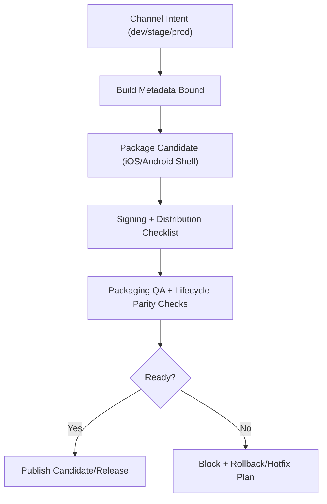

## Context

Znake currently ships as a web-first game with strong deterministic gameplay boundaries, but app-store release mechanics are not formally contracted. Packaging/distribution decisions (channels, version metadata, signing readiness, lifecycle parity checks, rollback readiness) need explicit contracts so releases are repeatable and supportable.

This design defines a minimal app-distribution foundation that remains maintainable and does not force deep native integration. It keeps gameplay simulation unchanged, keeps scene orchestration boundaries clear, and treats packaging as an operational shell around the existing game runtime.

## Key Points (Codex-style)

- **What is changing**
  - We add contracts for iOS/Android packaging capability, channel/version metadata, signing/distribution checklists, shell lifecycle parity, and packaging QA/rollback readiness.
- **Why we are doing it**
  - Distribution without explicit channel and readiness contracts creates launch risk, debugging ambiguity, and inconsistent release quality.
- **Impacted areas**
  - New app-distribution capability, tooling release workflows, mobile-readiness QA requirements, and scene lifecycle parity expectations under packaged shell execution.
- **Risks / unknowns**
  - Native wrapper choices and signing credential workflows vary by platform and may require provider-specific follow-up implementation.

## Goals / Non-Goals

**Goals:**
- Define packaging capability contract for iOS/Android app-shell distribution.
- Define channel-aware metadata contract for `dev`, `stage`, and `prod`.
- Define signing/distribution checklist requirements for candidates and releases.
- Define app-shell lifecycle parity expectations versus web gameplay behavior.
- Define minimal packaging-specific QA and rollback readiness contract.

**Non-Goals:**
- Full native feature parity beyond shell and lifecycle needs.
- Deep backend integration for release orchestration.
- Monorepo-wide or platform-wide tooling rewrite.

## Decisions

### Decision: Introduce a dedicated `app-distribution` capability

- Distribution concerns are modeled as a first-class capability rather than scattered across unrelated specs.
- Rationale: clear ownership and clearer archive/update behavior for future distribution work.
- Alternative considered: fold all requirements into `mobile-readiness`. Rejected to avoid overloading readiness scope.

### Decision: Standardize on a release metadata tuple across channels

- Builds and release artifacts use `release_version`, `release_channel`, and `build_id` as minimum metadata contract.
- Rationale: gives stable correlation across QA evidence, telemetry diagnostics, and distribution records.
- Alternative considered: channel-only metadata. Rejected due to ambiguity in multi-candidate workflows.

### Decision: Keep packaged shell behavior parity-focused

- Scene and lifecycle expectations require parity with web gameplay semantics (pause/resume/input safety/flow), not UI-identical shell chrome.
- Rationale: protects core player experience without requiring unnecessary native polish scope.
- Alternative considered: strict pixel parity across web/native shell. Rejected for high cost and low early-release value.

### Decision: Sign-off and rollback readiness are mandatory release artifacts

- Candidate/release decisions require explicit signing/distribution checklist evidence and rollback path metadata.
- Rationale: launch and hotfix quality depends on operational clarity as much as runtime stability.
- Alternative considered: defer rollback planning to post-launch playbook. Rejected as too risky for first store submission phase.

## Risks / Trade-offs

- [Wrapper-provider lock-in] -> Mitigation: keep contracts wrapper-agnostic and isolate provider-specific instructions in docs.
- [Credential handling mistakes] -> Mitigation: checklist requires explicit signing metadata without committing secrets to repo.
- [Lifecycle parity regressions in packaged shell] -> Mitigation: require parity-focused QA cases for background/foreground/input flows.
- [Scope creep into native feature backlog] -> Mitigation: enforce non-goals and keep this change packaging/distribution-focused.

## Migration Plan

1. Add OpenSpec deltas for `app-distribution`, `mobile-readiness`, `tooling`, and `scenes`.
2. Implement minimal repo workflow artifacts and scripts aligned with channel metadata contract.
3. Run candidate packaging simulation with checklist artifacts and parity QA evidence.
4. Validate with `pnpm check`; run `pnpm build` only when behavior/architecture impact justifies it.

Rollback strategy:
- If packaging workflow additions block regular web iteration, keep channel scripts/docs but gate execution to explicit release commands.
- If parity checks reveal blockers, hold candidate and keep web release flow unchanged while fixes land.

## Open Questions

- Which shell technology (for example Capacitor vs alternative) is the preferred baseline for first implementation pass?
- Should release channel metadata be injected at build-time only, or also persisted into generated distribution manifests?
- Do we require one or two approvers for final store submission sign-off?
