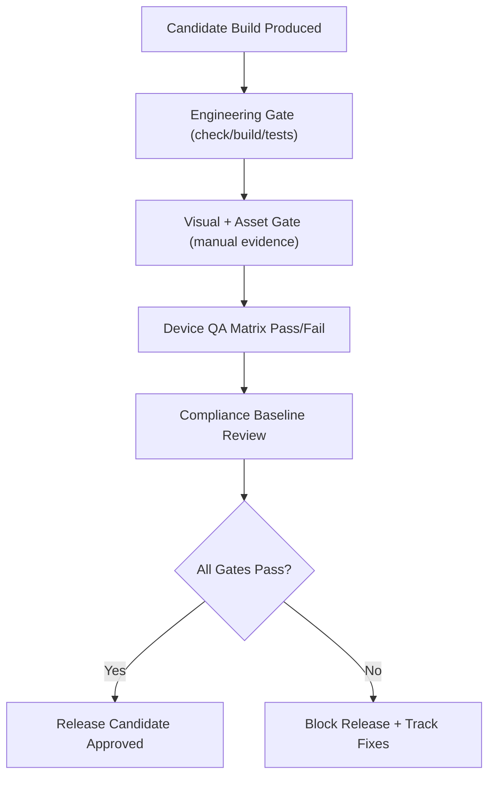

## Context

Znake already has strong gameplay and telemetry foundation, but release-readiness criteria are fragmented across engineering and manual review habits. Current specs describe gameplay/system behavior, yet do not define a single release-candidate (RC) contract that gates launch decisions across engineering health, visual/asset quality, observability, compliance, and device QA.

This design introduces a lightweight release foundation that is enforceable without heavy platform rewrites. It keeps gameplay determinism untouched, keeps `GameScene` orchestration boundaries intact, and prioritizes data-driven release decisions over ad-hoc approvals.

## Key Points (Codex-style)

- **What is changing**
  - We add formal OpenSpec contracts for RC gates, production error capture with release tagging, KPI dashboard minimums, compliance baseline checks, and a minimal device QA pass/fail matrix.
- **Why we are doing it**
  - We need a professional and repeatable release path that catches regressions early and makes launch/no-launch decisions auditable.
- **Impacted areas**
  - Tooling release process, observability payload contracts, mobile readiness QA expectations, scene-level diagnostics visibility, and UI disclosure requirements.
- **Risks / unknowns**
  - Some KPI cuts may require telemetry field normalization; visual/asset gates remain partly manual at first and may vary by reviewer rigor.

## Goals / Non-Goals

**Goals:**
- Define an enforceable RC gate contract covering engineering, visual, and asset quality.
- Define release-tagged runtime error capture behavior for production diagnostics.
- Define a minimum KPI dashboard contract sourced from existing telemetry events.
- Define compliance baseline metadata/disclosure requirements.
- Define a minimal device matrix with explicit RC pass/fail policy.

**Non-Goals:**
- Full backend migration for observability or analytics ingestion.
- Fully automated cross-device visual regression suite.
- Complete store creative production pipeline.

## Decisions

### Decision: Keep release foundation contract-first and lightweight

- We will encode release requirements as OpenSpec requirement deltas plus minimal repo-level tooling/process support.
- Rationale: reduces implementation risk and keeps iteration speed high while still making release decisions enforceable.
- Alternative considered: build a full CI/CD gate service first. Rejected for scope and dependency overhead.

### Decision: Use release metadata tuple for diagnostics and readiness

- Release-critical observability and QA artifacts will reference a shared metadata tuple: `release_version`, `release_channel`, `build_id`.
- Rationale: stable join key across runtime errors, KPI dashboards, and RC evidence.
- Alternative considered: rely on commit SHA only. Rejected because channel-aware release decisions need explicit build-channel context.

### Decision: Preserve deterministic simulation boundaries

- RC, compliance, and diagnostics behavior will live in tooling/system/UI surfaces and not alter simulation rule resolution.
- Rationale: protects deterministic gameplay invariants and keeps run outcomes reproducible.
- Alternative considered: embed gate logic inside scene gameplay loops. Rejected due to coupling and determinism risk.

### Decision: Explicit manual-review checkpoints for visual/asset/compliance checks

- RC contract includes manual review sections with required pass evidence fields.
- Rationale: immediately usable quality bar without waiting for full automation.
- Alternative considered: postpone checks until automation exists. Rejected because it creates launch quality blind spots.

## Risks / Trade-offs

- [Manual visual/asset review variance] -> Mitigation: require explicit checklist evidence fields and reviewer sign-off metadata.
- [Telemetry fields are present but inconsistent for KPI aggregation] -> Mitigation: define bounded KPI payload requirements and fallback classification rules.
- [Release metadata drift across tools] -> Mitigation: define a single required metadata tuple and validate presence at RC gate time.
- [Scope creep into full mobile packaging work] -> Mitigation: explicitly limit this change to foundational gates and QA/compliance contracts only.

## Migration Plan

1. Add OpenSpec requirement deltas for affected capabilities.
2. Implement minimal tooling/runtime support required by tasks (checklist/gate artifacts, release metadata wiring, observability capture contract support).
3. Validate with `pnpm check` and targeted release-foundation smoke verification.
4. Run one RC dry run in staging using the new contract and capture gaps as follow-up changes.

Rollback strategy:
- If new gate artifacts block active development unexpectedly, keep contracts while temporarily marking affected checks as advisory for non-release branches.
- Runtime diagnostics wiring can be toggled to no-op if it causes instability, without changing simulation behavior.

## Open Questions

- Which exact dashboard sink (local export vs external tool) will host the KPI view in the first release?
- Should device matrix include a strict minimum OS/version floor in this change or in follow-up mobile packaging work?
- Do we require compliance sign-off by one owner role or dual-owner (engineering + product/design) before RC approval?
