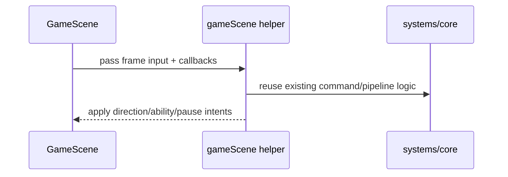

## Context

This change targets architecture quality and iteration speed by reducing scene coupling where graph hotspots are concentrated (`GameScene`, `MenuScene`).

## Key Points (Codex-style)

- What is changing
  - Scene-local orchestration logic is split into focused helper modules.
- Why we are doing it
  - Improve maintainability and simplify dependency graph navigation.
- Impacted areas
  - Scene orchestration boundaries and helper call paths.
- Risks / unknowns
  - Subtle ordering differences in input processing if extraction is not behavior-preserving.

## Goals / Non-Goals

**Goals:**
- Reduce direct orchestration complexity inside scene classes.
- Keep deterministic behavior and existing telemetry/feedback flows.
- Keep diffs narrow and reversible.

**Non-Goals:**
- No gameplay rule changes.
- No balance/config tuning.
- No new scene framework abstractions.

## Decisions

### Decision: Scene-local helper extraction over cross-layer rewrite
- Extract only bounded orchestration chunks into `scenes/*` helper modules.
- Rationale: lowest-risk simplification with immediate graph benefit.

### Decision: Callback-based side-effect wiring
- Helpers return intent or use injected callbacks for side effects (feedback, telemetry, transitions).
- Rationale: preserve behavior while keeping helper modules testable and decoupled.

### Decision: Preserve existing systems/core contracts
- Reuse existing `systems` and `core` APIs without contract changes.
- Rationale: keep change scope focused on scene coupling only.

## Risks / Trade-offs

- [Risk] Refactor can accidentally change command-processing order.
- [Risk] Menu challenge-share flow can lose telemetry parity if a branch is missed.
- [Trade-off] More files, but lower per-file complexity and cleaner boundaries.

## Migration Plan

1. Add helper modules and route existing scene methods through them.
2. Keep public scene behavior and side effects equivalent.
3. Run formatter + checks and verify no behavior deltas in smoke flow.

Rollback strategy:
- Revert helper wiring and restore previous inline scene code if parity issues appear.
