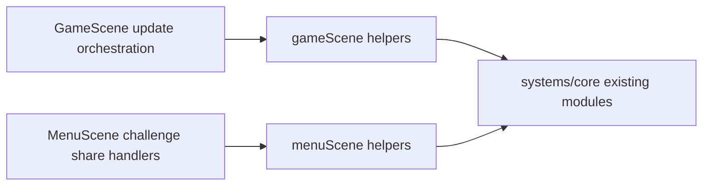

## Why

`GameScene` and `MenuScene` are currently high-connectivity graph hubs. This increases coupling, slows safe iteration, and makes orchestration changes harder to review.

## Key Points (Codex-style)

- What is changing
  - Extract scene-local orchestration helpers for virtual input handling in `GameScene` and challenge-share flows in `MenuScene`.
- Why we are doing it
  - Reduce graph complexity and scene fan-out while preserving behavior.
- Impacted areas
  - `src/game/scenes/GameScene.ts`
  - `src/game/scenes/MenuScene.ts`
  - New scene helper modules under `src/game/scenes/gameScene/**` and `src/game/scenes/menuScene/**`
  - `openspec/specs/scenes/spec.md`
- Risks / unknowns
  - Input handling regressions if helper boundaries are wired incorrectly.
  - Challenge share copy/import telemetry parity could drift if callbacks are missed.

## Agreed Scope And Outcomes

- Scope:
  - Technical refactor only (no gameplay, balance, or UX flow changes).
  - Keep scene responsibilities as orchestration, move reusable flow logic to helper modules.
- Outcomes:
  - Smaller and more legible scene methods.
  - Fewer direct scene-level dependencies.
  - Deterministic and behavioral parity preserved.

## What Changes

- Add OpenSpec requirements for scene-local orchestration extraction focused on graph simplification.
- Implement first apply iteration:
  - Extract virtual input frame handling from `GameScene.update()`.
  - Extract challenge share copy/import flow from `MenuScene` methods.
- Keep existing player-facing behavior equivalent.

## Capabilities

### Modified Capabilities

- affected spec: `scenes`

## Impact

- Affected code (expected):
  - `src/game/scenes/GameScene.ts`
  - `src/game/scenes/MenuScene.ts`
  - `src/game/scenes/gameScene/*`
  - `src/game/scenes/menuScene/*`
- No new dependencies.
